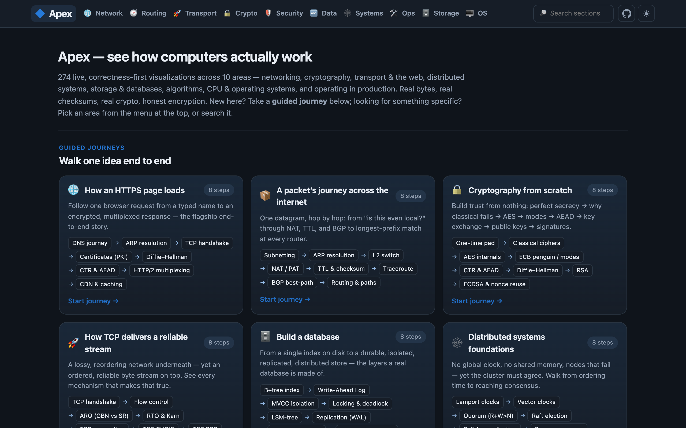

<div align="center">

# ◆ Apex

### See how computers *actually* work — live, in your browser

**~275 hands-on, correctness-first visualizations** you can poke, drag, and break — spanning networking,
cryptography, transport & the web, distributed systems, databases, algorithms, and OS internals.
Not static diagrams you have to synchronize in your head. Real bytes, real checksums, real crypto.

<br>

[](https://pen-pal.github.io/apex)

[](#)
[](#whats-inside)
[](#license)
[](#)
[](#)
[](#)
[](.github/workflows/codeql.yml)

<br>

<a href="https://pen-pal.github.io/apex"></a>

</div>

---

Type a message and watch it become bytes and travel the wire. Flood a hash table and watch O(1) collapse to
O(n²). Splay a tree, race a coordinator crash through two-phase and three-phase commit, poison a DNS cache and
watch source-port randomization defend it, rebind DNS to reach `localhost`, add two numbers that are still
encrypted. Every section is a small, **tested, spec-anchored model** with an interactive view — no hand-waving,
no faked outputs.

### Guiding principles

> 🔬 **The bytes (and the math) are real.** Real checksums, real CRC-32, RFC-accurate fields, published crypto
> test vectors, capture-anchored tests. Nothing is faked to look plausible.
>
> 🧩 **A protocol is data, not code.** The network dissector reads a small `ProtocolSpec` per protocol, so
> adding one is adding a file — never rewriting the engine.
>
> ✅ **Every model is verified.** Each section ships a pure, framework-free model with its own test suite,
> checked against the RFC / paper / reference implementation — not against its own output.

## What's inside

**~275 interactive sections across 10 areas** — plus **guided journeys** (curated end-to-end walks like
*"How an HTTPS page loads"*, *"Inside the CPU"*, *"Build a database"*) and a global filterable catalog with
a **dark-mode** toggle.

| Area | A taste of what's inside |
|------|--------------------------|
| 🌐 **Network basics** | Build a real Ethernet/IPv4/TCP frame from your text and follow it byte-by-byte; ARP, switching, NAT, DHCP, subnetting, the on-the-wire signal, 90+ protocols + `.pcap` import |
| 🧭 **Routing & naming** | BGP best-path & route reflectors, OSPF, DNS, DNSSEC, **DNS cache poisoning (Kaminsky)**, MPLS, VXLAN, VRRP, ECMP, IPsec |
| 🚀 **Transport & web** | TCP handshake & state machine, congestion control (CUBIC/BBR), QUIC vs TCP, **connection migration**, **0-RTT replay**, HTTP/2 & /3, **MPTCP**, WebSockets, CDNs |
| 🔒 **Cryptography** | AES rounds, AEAD, Diffie–Hellman, RSA/ECC/EdDSA, Schnorr ZK, the double ratchet, VRFs, **Paillier homomorphic** encryption, **envelope encryption (KMS)**, Shamir/threshold, post-quantum |
| 🛡️ **Security & web** | CORS, CSP, request smuggling, SSRF, **DNS rebinding**, clickjacking, **hash flooding**, **ReDoS**, **prototype pollution**, subdomain takeover, WebAuthn |
| 🔤 **Data & encoding** | Huffman, arithmetic & **Golomb-Rice** coding, LZ77/LZW, BWT, **Gorilla** time-series, **COBS** framing, CRC-32, Reed–Solomon, Viterbi |
| 🕸️ **Distributed systems** | Raft, Paxos, PBFT, vector/Lamport clocks, CRDTs, gossip, quorums, 2PC & **3PC**, chain replication, hinted handoff, **read repair**, SWIM, HdrHistogram |
| 🗄️ **Storage, DB & algorithms** | B+trees, LSM, MVCC, WAL; a deep algorithms track — sorting, **Kadane**, KMP/Aho–Corasick/Manacher, suffix arrays, max-flow, MST, **interval trees**, **treaps**, splay trees, tries |
| 🖥️ **Systems & OS** | CPU pipeline & branch prediction, MESI, **false sharing**, x86-TSO, virtual memory & page-table walks, TLB, copy-on-write, NUMA, CFS, epoll & C10k, futex, io_uring |
| 🛠️ **Operations & SRE** | Deployment strategies, health checks, autoscaling, SLOs & error budgets, load shedding, idempotency, distributed tracing, feature flags, single-flight, chaos |

> Full catalog is browsable in-app — use the search box in the top bar, or pick an area from the menu.

## Quick start

```bash
npm install
npm run dev             # start the UI at http://localhost:5173
npm run test:run        # run the full test suite (2500+ tests)
npm run typecheck       # tsc --noEmit
npm run demo            # CLI: build a real frame from "Hi" and dissect it back
npm run demo -- "GET /" # try your own message
```

`npm run demo` builds a real Ethernet/IPv4/TCP frame from your message — with real checksums and a real
CRC-32 FCS, padded to the 64-byte Ethernet minimum — then dissects those bytes back and recovers your message,
proving nothing is faked.

## How it's built

```
src/core/        the generic dissection engine (types, bit reader, checksums, dissect, build)
src/protocols/   the DATA: one ProtocolSpec per protocol — adding a protocol is a file here
src/web/         the React UI — one tested model (.ts) + one view (*Section.tsx) per topic
tests/           vitest — every protocol and every model ships an anchored test
docs/            architecture.md · protocol-spec.md · views.md
```

Each non-network section follows the same shape: a **pure, dependency-free model** in `src/web/<topic>.ts`
(with `tests/<topic>.test.ts` anchored to the reference), a **view** in `src/web/<Topic>Section.tsx`, and one
line of wiring. Models never import React, so they run in the CLI and the browser alike.

**Stack:** TypeScript + React + Vite, tested with [vitest](https://vitest.dev) — a fully static, client-side
app with no backend (the engine and crypto run in the browser). CI runs the test suite and **CodeQL** code
scanning on every push and PR; a deploy workflow publishes to GitHub Pages.

## Contributing

The bar is simple and strict: a new section is a **tested model + a view**, and the model is validated against
the source of truth (an RFC, a paper, a published test vector, or a brute-force reference) — never against
itself. Keep `src/core/` free of protocol-specific knowledge so the engine stays generic. See
[`docs/protocol-spec.md`](docs/protocol-spec.md) to add a protocol and
[`docs/architecture.md`](docs/architecture.md) for the design.

## What it is — and isn't

It builds and dissects real bytes, and runs real algorithms and crypto, **for teaching**. It is not a packet
injector or a traffic tool. For encrypted protocols (TLS, QUIC, WireGuard, ESP) it shows the cleartext header
and leaves the encrypted body genuinely opaque — it never claims to decrypt a real captured stream, which
would need session keys and is out of scope. The crypto sandbox operates on sandbox values only.

## License

[MIT](LICENSE).
